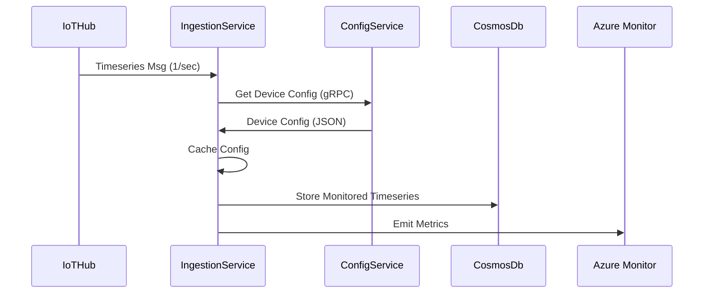
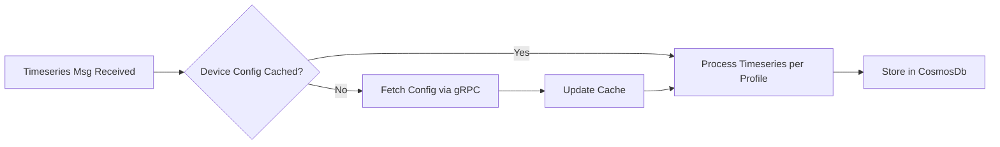

1. Clarifying Questions

- How frequently do device configuration updates occur? Should cache updating be event-driven (push) or is polling acceptable?
- Do monitored timeseries vary dynamically per device (i.e. can monitoring profiles change at runtime)?
- What is the desired latency for ingestion and config lookup? (sub-second, 5s, etc.)
- Is CosmosDb partitioning based on deviceId or timeseries name?
- Any regulatory/compliance needs (GDPR, etc.) on the data stored?
- Is there an existing pattern for secrets (Azure KeyVault) and managed identity use?
- Should monitoring include metrics for throughput, latency, and failures per device/operation?
- Are config changes expected to be validated or versioned?

---

2. Proposed Architecture Summary

**Overview:**
A resilient, scalable Azure-based microservices solution for timeseries processing from IoTHub:
- **IngestionService**: Listens to IoTHub, processes timeseries messages per device, fetches device configuration from ConfigService via gRPC, caches config, stores filtered timeseries data in CosmosDb.
- **ConfigService**: Serves device configs from Storage Account JSON files, provides gRPC endpoint for config retrieval. Manages device and monitoring profile mappings.
- **Internal Communication**: Secure, fast gRPC with mTLS.
- **Storage**: CosmosDb (for timeseries), Storage Account (for config), KeyVault for secrets.
- **Scaling**: Both microservices can scale independently (AKS/ACI/Apps), CosmosDb autoscale enabled.
- **Monitoring**: Azure Monitor, App Insights for metrics, traces, and logs. Custom telemetry for ingestion latency and volume.

**Design Patterns**:
- Repository pattern for CosmosDb in ingestion.
- Caching (with invalidation) in ingestion.
- Outbox for idempotency on storage.
- CQRS for config management.
- Strategy pattern for device profile processing.


---

3. Mermaid Diagrams

### Component Diagram

```mermaid
graph TD
    A[Azure IoTHub] --> B(IngestionService)
    B --> C[CosmosDb]
    B -. gRPC .-> D(ConfigService)
    D --> E[Azure Storage Account (Config Files)]
    B --> F[Azure Monitor / App Insights]
    D --> G[Azure KeyVault]
    B --> G
```

---

### Sequence Diagram (Ingestion Flow)



---

### Flow Diagram (Config Retrieval and Caching)



---

4. Work Items Split

---

#### DevOps

- Provision IoTHub, CosmosDb, Storage Account, KeyVault, AKS/ACI, Monitor via Terraform.
- Setup managed identity and secure networking.
- CI/CD pipelines for both microservices, config as code.
- Configure App Insights, Azure Monitor (custom metrics).
- Environment config for dev/test/prod.

---

#### Developer

- Implement IngestionService (.NET 10), gRPC client/server, caching, repository pattern, circuit-breaker/retry logic.
- Implement ConfigService (.NET 10), gRPC server, config file access, CQRS.
- Device/monitoring profile schema validation.
- Telemetry integration.
- Unit/integration tests for ingestion, config lookup, storage.

---

#### QA

- Develop test cases for ingestion, config retrieval, cache invalidation.
- Load/smoke tests for message ingestion (scale/latency).
- Validate config changes and versioning.
- e2e test flows, regression scenarios.
- Automated test coverage for all flows.
- Monitoring setup validation.

---

5. Risks, Assumptions, Open Questions

**Risks:**
- Config cache staleness leading to incorrect processing.
- Throughput bottlenecks if config retrieval slows.
- CosmosDb partitioning/miss impacts scalability.
- gRPC comms need for secure mTLS.
- Message deduplication/idempotency must be handled.

**Assumptions:**
- Config updates are rare; cache invalidation is periodic or via versioning.
- Azure Monitor and App Insights will be sufficient for observability.
- Device/monitoring profile schema stable.
- DevOps will handle network isolation and identity.
- IoTHub throughput capacity is not a bottleneck.

**Open Questions:**
- Is config change notification/eventing needed?
- Maximum expected number of devices/messages?
- Data retention requirements in CosmosDb.
- Configuration versioning/rollback needed?

---

6. PR Architecture Review Checklist

- Service boundaries (Ingestion/Config) respected, clear gRPC contract.
- CosmosDb and Storage Account usage per design.
- Caching logic adheres to architecture (expiry/refresh).
- Circuit-breaker/retry for gRPC/cosmos access in place.
- Device config schema matching architecture.
- Observability: monitoring, metrics, logging integrated.
- Security: managed identities, KeyVault usage, mTLS for gRPC.
- Network isolation (VNet, NSG) implemented.
- Deployment and scaling approach (AKS/ACI/autoscale) not regressed.
- Tests and API contracts properly validated.
- All deviations from design are documented.

---

Output must be manually verified.